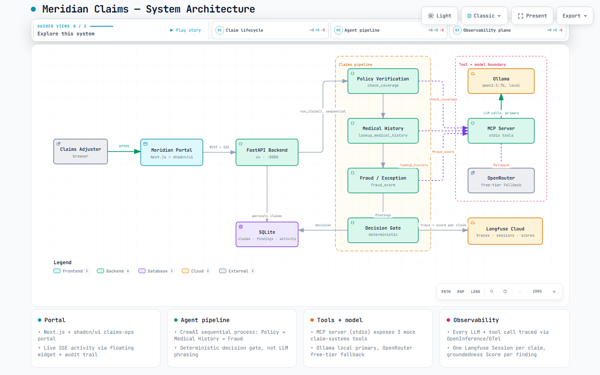
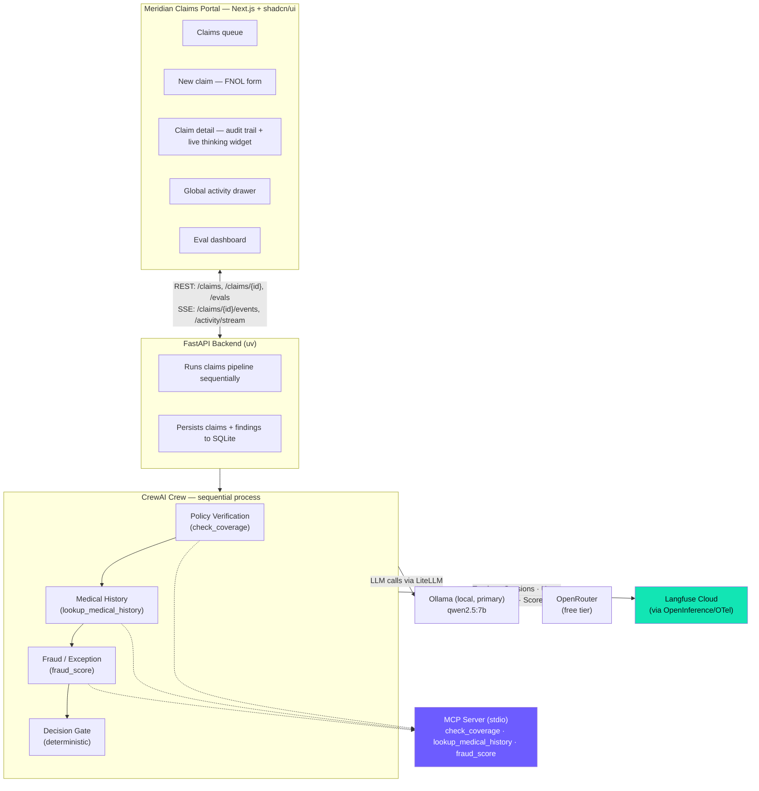

# Meridian Claims — Multi-Agent LLM Observability Demo

**A real, running health-insurance claims-adjudication system built to demonstrate what production-grade multi-agent observability actually looks like — not a toy example.** Three CrewAI agents (Policy Verification, Medical History, Fraud/Exception) call tools through MCP, a deterministic decision gate approves/denies/routes each claim, and every step — every LLM call, every tool call, every score — is traced live in Langfuse Cloud. No mocks pretending to be a product, no Docker required. Full design/rationale: [PRD.md](PRD.md).

**Topics:** `llm-observability` `multi-agent-systems` `ai-agents` `crewai` `langfuse` `mcp` `model-context-protocol` `fastapi` `nextjs` `llmops` `agentic-ai` `enterprise-ai` `python` `typescript`



## Architecture



Also as ASCII, for terminals/plain-text viewers:

```
┌──────────────────────────┐   REST /claims, /claims/{id}, /evals   ┌───────────────────────────┐
│  Meridian Claims portal  │ ─────────────────────────────────────► │   FastAPI backend (uv)    │
│  (Next.js + shadcn/ui)   │ ◄───────────────────────────────────── │                           │
│  - Claims queue          │        SSE /claims/{id}/events         │  - runs the claims         │
│  - New claim (FNOL form) │        SSE /activity/stream            │    pipeline sequentially   │
│  - Claim detail / audit  │                                        │  - persists claims +       │
│    trail + live widget   │                                        │    findings to SQLite      │
│  - Global activity drawer│                                        └─────────────┬─────────────┘
│  - Eval dashboard        │                                                      │
└──────────────────────────┘                                                     ▼
                                       ┌───────────────────────────────────────────────────────────────────┐
                                       │                    CrewAI Crew (sequential)                        │
                                       │  Policy Verification → Medical History → Fraud/Exception → Decision│
                                       │  (check_coverage)      (lookup_medical_    (fraud_score)    Gate    │
                                       │                          history)                          (deterministic)│
                                       └────────┬─────────────────────┬──────────────────┬──────────────────┘
                                                │                     │                  │
                                                ▼                     ▼                  ▼
                                       MCP server (stdio) — check_coverage / lookup_medical_history / fraud_score
                                                │
                    LLM calls (LiteLLM) ───────┼──────────────────────────────────────┐
                                                ▼                                       ▼
                                    Ollama local (primary, qwen2.5:7b)      OpenRouter (free tier, fallback)
                                                │
                                                ▼
                                   Langfuse Cloud (Tracing, Sessions, Users,
                                   Datasets, Scores, via OpenInference/OTel)
```

SQLite is the app's own operational store (the claims queue, audit trail, and persisted activity log the portal reads directly). Langfuse is the observability/eval system of record — every "View trace ↗" link in the portal points back to it.

## Stack

- **Backend:** Python 3.12 (`uv`), CrewAI (sequential process), FastAPI, SQLite
- **Tool integration:** a local MCP server (stdio) serving `check_coverage`, `lookup_medical_history`, `fraud_score` — agents call tools through CrewAI's MCP adapter, not direct function calls
- **LLM:** Ollama (local, `qwen2.5:7b`, runs on a 6GB-VRAM GPU) primary, OpenRouter (free tier) fallback
- **Observability:** Langfuse Cloud — Tracing, Sessions (one per claim), Users (tagged by patient), Datasets + Dataset Runs + Scores for the eval loop, plus an app-managed LLM-as-judge for continuous groundedness scoring
- **Frontend:** Next.js + shadcn/ui — a claims-ops portal (navy/serif "Meridian" identity), with a floating live-agent "thinking" widget, per-step inline logs, and a global activity drawer, all driven by real SSE events off the backend

## Prerequisites

- [uv](https://docs.astral.sh/uv/) (Python package/venv manager)
- [Ollama](https://ollama.com) installed and running, with `qwen2.5:7b` pulled:
  ```
  ollama pull qwen2.5:7b
  ```
- Node.js + npm (for the frontend)
- A [Langfuse Cloud](https://cloud.langfuse.com) project (free tier) for trace/eval keys
- An [OpenRouter](https://openrouter.ai/keys) API key (free tier fallback)

## Setup

1. Copy `.env.example` to `.env` and fill in your Langfuse and OpenRouter keys:
   ```
   cp .env.example .env
   ```
2. Install backend dependencies:
   ```
   uv sync
   ```
3. Seed the Langfuse eval dataset (sample claims with known-correct decisions):
   ```
   uv run python -m src.seed_evals
   ```
4. Install frontend dependencies:
   ```
   cd frontend && npm install
   ```

## Running

**Backend (FastAPI, port 8000):**

```
uv run uvicorn src.api:app --port 8000
```

**Frontend (Next.js, port 3000):**

```
cd frontend && npm run dev
```

Open http://localhost:3000 — a plain-text login gate sits in front (`admin` / `admin`, demo-only, not a real auth boundary). Claims queue at `/`, file a new claim at `/claims/new`, eval dashboard at `/evals`, live system-wide activity via the "Activity" icon in the sidebar.

**CLI (no frontend needed) — runs one claim through the pipeline and prints the decision + trace URL:**

```
uv run python main.py
```

**Run the eval suite (re-runs every seeded claim, records pass/fail + a Langfuse Score):**

```
uv run python -m src.run_evals <label>
```

## Project layout

```
src/
  agents.py       CrewAI agents (Policy Verification / Medical History / Fraud) + sequential pipeline + decision gate
  mcp_server.py   MCP server (stdio): check_coverage, lookup_medical_history, fraud_score + mock data (patients, policies, claims)
  llm.py          Ollama-primary / OpenRouter-fallback LLM config
  tracing.py      Langfuse instrumentation (Sessions, Scores, app-managed groundedness judge)
  db.py           SQLite schema/connection (claims, findings, activity log, eval history)
  events.py       In-process pub/sub for live per-claim and global activity events (SSE)
  api.py          FastAPI app (/claims, /claims/{id}, /claims/{id}/events, /activity/stream, /evals)
  seed_evals.py   Seeds the Langfuse eval dataset with sample claims
  run_evals.py    Runs the eval suite against the real pipeline, records pass/fail + Langfuse Score
frontend/         Next.js + shadcn/ui "Meridian Claims" portal
main.py           CLI entrypoint
PRD.md            Full product/architecture doc, including the pivot history from the original generic demo
presentation/     Companion conference talk deck + speaker script
```

## Notes

- Every claim's audit trail links to its Langfuse trace ("View trace ↗") so you can see the actual spans (agent → LLM → MCP tool call → groundedness score) behind any decision.
- The eval dashboard (`/evals`) shows decision-routing pass/fail per seeded claim, backed by a real Langfuse Dataset — not a hardcoded fixture.
- A real failure was caught and fixed this way during development (a seed-data gap that let a claim route incorrectly) — see the eval history and `SPEAKER_SCRIPT.md` for the story.
- No Docker/Podman required — everything runs as a plain process or a hosted free-tier service.
